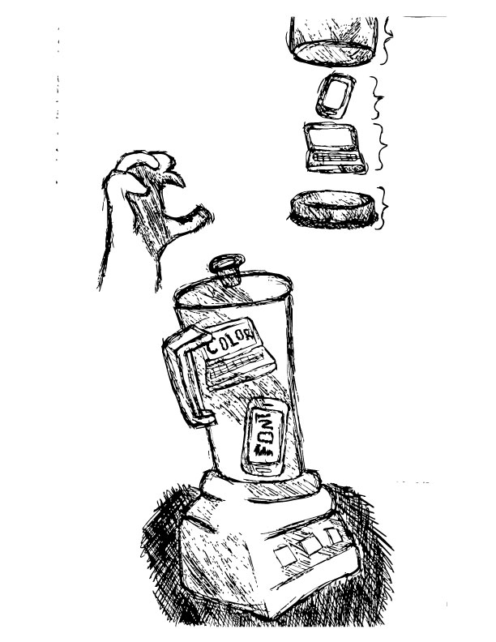

# Summary
<header class="title">

<figure class="artwork" id="hero">

# A Summary of A Dao of Web Design

By [Jylik Buissereth](#jylik-buissereth) <time datetime="2017-09-10">September 14, 2017</time>

</figure>

</header>

<figure class="artwork"></figure>

*   [Summary](#summary)
*   [About the Author](#about-the-author)

* * *

## Summary

The article <cite>A Dao of Web Design</cite> by John Allsopp in short pertains to the fact that design is nothing more than another turn of the century thing with rules and concepts. It’s like when paper became a huge thing and rules were made for typesetting and now it has all become standard. The same can be said for web design in the sense that there are rules for the universal platform of the internet whether it be a mobile device or a desktop. As a designer one has to be able to dictate the web page while also understanding that there is a great deal outside of what is in control. Allow the design to be set to a standard while also being flexible to all viewers and users alike.

<figure>

> "Well established hierarchies are not easily uprooted; Closely held beliefs are not easily released; So ritual enthralls generation after generation."

-Tao Te Ching; 38 Ritual

</figure>

The greatest challenge introduced within the article is the fact that we as consumers as well as designers have to view things differently. The web itself is not a rigid construct but instead a flexible strand of code that can shifted and changed in an instant. While this flexibility may frighten those who have gotten used to the rigidity of print where what is put on the paper is final it is actually the best part of the web as a whole.

> "The journey begins by letting go of control, and becoming flexible."

-John Allsop

Read full article [A Dao of Web Design](https://alistapart.com/article/dao) by John Allsopp.

<section id="jylik-buissereth">

## About the Author

<figure class="headshot"></figure>

### Jylik Buissereth

Jylik Donell Buissereth was born in New York where he first started going to art school as a freshman in high school. During his time at Art and Design High School he fell head over heals for graphic Design and decided tp continue doing so in college. He now resides in Beverly, Massachusetts attending Montserrat College of Art where he is currently choosing a concentration. While graphic design has always been his passion he has found a new love in sculpture and all it entails.

</section>
